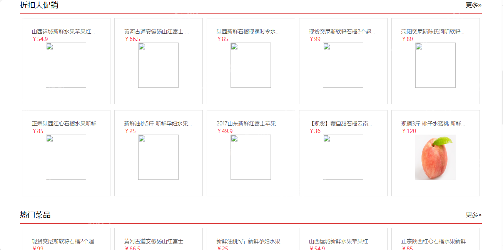

<h1 align="center">72.网上订餐管理系统</h1>

 获取sql文件 QQ: 386869957 QQ群: 377586148 

 [推荐站点: 从戎源码网](https://armycodes.com/) 

## 简介

> 本代码来源于网络,仅供学习参考使用!
>
> 提供1.远程部署/2.修改代码/3.设计文档指导/4.框架代码讲解等服务
>
> 用户登录地址: http://localhost:8080/login/uLogin.action
> 
> 用户: zs  123456
> 
> 管理员登录地址：http://localhost:8080/login/login
>
> 管理员: admin  123456

## 项目介绍
基于ssm的网上餐厅管理系统：前端jsp、jquery、bootstrap，后端 maven、springmvc、spring、mybatis，集成类名管理、菜品管理、订单管理、用户浏览菜品、购物车、收藏、我的订单等功能于一体的系统。

## 功能介绍

### 管理员

- 类目管理：类目信息的增删改查，类目二级的增删改查
- 用户管理：用户列表，关键词搜索
- 菜品管理：菜品信息的增删改查，根据菜品名称搜索
- 订单管理：前台用户下单后，管理员在此可以查看用户提交的订单信息，查看购买的商品，去发货操作、订单状态的跟踪、订单号搜索
- 公告管理：公告信息的增删改查，关键词搜索
- 售后管理：顾客留言信息查看和删除

### 用户

- 基本功能：登录、注册、退出、密码修改
- 首页：关键词搜索、轮播图、菜品分类导航浏览、折扣打促销列表、热门菜品列表、推荐菜品列表
- 菜品：菜品详情，收藏，加入购物车，购物车列表，购物车结算
- 个人中心：个人信息查看与修改，我的订单列表，订单取消，订单评价，订单收货确认，菜品收藏列表，菜品取消收藏

## 环境

- <b>IntelliJ IDEA 2009.3</b>

- <b>Mysql 5.7.26</b>

- <b>Tomcat 7.0.73</b>

- <b>JDK 1.8</b>

## 运行截图

